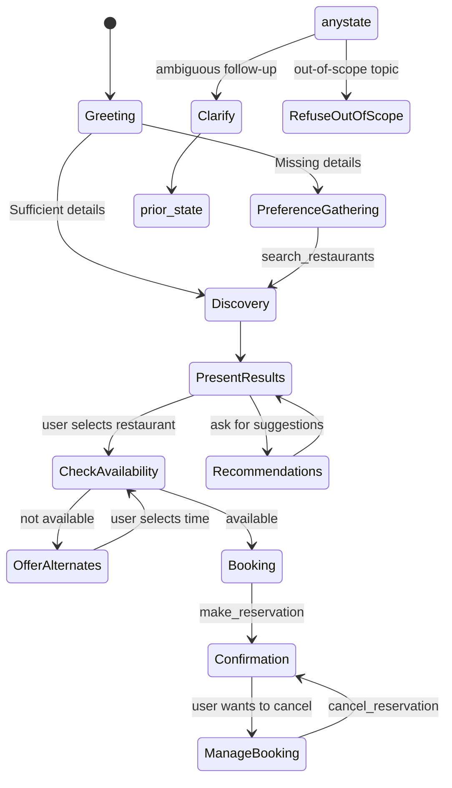

# Goal

Build a delightful, reliable AI reservation concierge (GoodFoods) that helps guests discover restaurants, check availability, and book/cancel reservations conversationally, while showcasing tool-calling best practices, streaming UX, and guardrails for out‑of‑scope queries.

## Long Term Goal

- Become the preferred conversational layer for mid‑market restaurant groups to increase seat utilization, drive repeat visits, and reduce call-center load.
- Evolve into a vertical platform (dining → hospitality → local services) with pluggable data sources, MCP tools, and multi‑tenant branding.

## Success Criteria

- Conversion: ≥25% of unique sessions end with a successful reservation or saved shortlist.
- Time to answer: P95 response to first useful list < 3.0s (excluding LLM latency spikes).
- Accuracy: ≥95% of tool invocations return valid, formatted data (no hallucinated venues).
- Deflection: ≥40% reduction in human agent calls for availability and basic booking.
- Retention: ≥30% returning users within 30 days for the same geography.
- NPS: ≥60 from embedded in‑chat thumbs/mini‑survey.

## Use case

A guest opens the GoodFoods chat and asks for “Indian restaurants near Downtown for 4 tomorrow at 7pm.” The assistant calls structured tools (search → availability), explains 2–5 options in a consistent format, proposes alternates if a slot is full, and books the preferred option after collecting the customer name. The chat supports follow‑ups like “Any other recommendation?” and “Cancel my 8pm booking,” with helpful clarifications and safe refusals for out‑of‑scope topics (e.g., weather). The UI streams responses with a clean typing indicator, shows live tool activity, and keeps the conversation fast, friendly, and formatted.

## Key Steps (Bot flow)

1. Greet and scope
   - Greet the user; clarify preferences if missing (cuisine, area, date/time, party size).
2. Discover
   - Call `search_restaurants` with provided constraints; present results with consistent template (name, cuisine, location, address, rating, price, description).
3. Check availability (optional)
   - For chosen venue, call `get_availability`; if unavailable, propose 2–3 alternates.
4. Book
   - Collect customer name; call `make_reservation`; confirm details with a clear summary.
5. Manage booking
   - Accept reservation ID to call `cancel_reservation` if needed; show cancellation summary.
6. Recommendations
   - Use `get_recommendations` for preference‑driven suggestions.
7. Guardrails
   - If query is out‑of‑scope, politely refuse and redirect; if ambiguous (“Any other recommendation”), ask a concise clarifying question.

## State Transition Diagram

## Bot Features

- Implemented capabilities (codebase)

  - Agent loop with tool calling (Cerebras LLM + MCP Server) in `agent/agent.py`.
  - Tools exposed in `mcp_server/server.py`: `search_restaurants`, `get_availability`, `make_reservation`, `cancel_reservation`, `get_recommendations`.
  - In‑memory DB in `database/restaurant_db.py` with models in `database/models.py`.
  - Streamlit UI (`app.py`) with:
    - Live streaming, message placeholders, “View tool calls” expander, post‑tool thinking indicator, speed selector, clear‑chat.
    - Custom CSS animations (typing/thinking dots, pulse glow), responsive layout, accessibility tweaks.
  - Guardrails:
    - System prompt scope enforcement (restaurants only; refuse out‑of‑scope politely).
    - Heuristic for ambiguous follow‑ups (“Any other recommendation?”, “More?”, name requests).
  - Tool‑loop safety:
    - Prevent duplicate tool calls by disabling tools after execution when soliciting the final text response.
  - Availability logic with alternative slots suggestion (server computes alternates).

- Knowledge bases (KBs)

  - Seeded, in‑memory catalog (`database/seed_data.py` → loaded in `app.py`). Can be swapped for external POS/booking APIs later.

- Tools

  - Yes. Implemented through an MCP Server; schema aligns with OpenAI‑style function calling.

- Languages/Stack

  - Python 3.11, Streamlit frontend, Cerebras Cloud SDK for LLM, custom MCP server, Mermaid docs.

- Newly added/visible features

  - Live tool telemetry in UI; consistent list formatting; out‑of‑scope refusal; minimal thinking indicator; streaming cursor.

- Difficulty (Green/Yellow/Red)

  - Green: Search, list formatting, recommendations, UI polish, clear chat.
  - Yellow: Availability modeling with alternatives, duplicate tool‑call prevention, ambiguous follow‑up handling.
  - Red: Real‑time inventory sync with external systems; multi‑tenant, PCI/PII compliance; abuse/automations control.

- Integrations (phased)
  - Phase 1: Cerebras LLM; in‑memory DB; email webhook for confirmations.
  - Phase 2: POS/booking APIs (SevenRooms, OpenTable), maps/geocoding, payments for deposits.
  - Phase 3: CDP/CRM (Braze, Segment), fraud/abuse detection, analytics pipeline.

## Scale up / Rollout Strategy

- Pilot (2–4 weeks)
  - One geography; 20–50 venues; “shadow mode” (recommendations only), then enable booking windows.
  - Measure conversion, time‑to‑first‑value, and accuracy; collect staff feedback.
- Beta (4–8 weeks)
  - Integrate one booking API; add SLA monitoring; introduce branding/config for chains.
- GA
  - Multi‑tenant dashboard, analytics, “VIP rules,” waitlist handling; SLOs and incident runbooks.

## Key Challenges

- Data quality and synchronization with real inventory systems.
- Guardrails vs. recall: keeping assistant helpful without hallucinating venues or confirming unavailable slots.
- Latency and cost control for peak hours.
- Abuse/automation (botting bookings), cancellations churn, and no‑shows.
- Change management with staff and existing workflows.

## Assumptions

- Seeded dataset approximates real menus/venues; no external booking integration in the current repository.
- Customers accept chat as a primary interface on web/mobile landing pages.
- Email/SMS confirmations handled outside initial scope.

## Limitations (current repo)

- In‑memory DB (non‑persistent); no user accounts or auth.
- No third‑party booking API integration yet.
- Basic recommendation logic (rule‑based filters + ranking), not collaborative filtering.
- Error messages from upstream LLM may still surface for rare malformed tool generations.

## Future Enhancements

- Integrations: OpenTable/SevenRooms, GMaps, payments (deposits), loyalty/CRM.
- Personalization: embeddings, re‑ranking, taste profiles, cross‑venue itineraries.
- Operations: waitlist orchestration, table‑level assignment, auto‑overbooking controls.
- Guardrails: structured tool‑error recovery path (parse failed_generation → re‑invoke tools safely), conversation safety filters.
- Analytics: funnel dashboards, A/B tests on prompts, cohort retention.

## Success Metrics & Timeline

- Month 1: POC metrics (≥20% conversion, <4s P95 for first list, ≤2% tool errors). Ship pilot.
- Month 2–3: Integrate a booking API; reach ≥30% conversion; add waitlists; instrument analytics.
- Month 4–6: Enterprise readiness (multi‑tenant, SSO for staff, SLAs, observability).

## Stakeholders & Customers

- Stakeholders: Restaurant Ops, Marketing/Growth, IT/Integrations, Customer Support.
- Initial customers: Independent groups (10–200 locations) with uneven seat utilization.
- Channels: Direct sales to groups; partnerships with POS/booking providers.

## Vertical Expansion Opportunities

- Hospitality: hotel restaurants, room service, spa appointments.
- Entertainment: theaters, events, wine tastings.
- Local services: salons, fitness classes, experiences (bookable inventory + recommendations).

## Non‑obvious Business Opportunities

- Dynamic pricing or deposit-policy experiments by demand window.
- Sponsored placements for venues (clearly labeled) with relevance constraints.
- Post‑meal re‑engagement: reviews, rebook prompts, loyalty progression.

## Competitive Advantages

1. Tool discipline and UX: clean separation of tool phases and streaming UI with transparent tool telemetry → higher trust and conversion.
2. Guardrails by design: scope enforcement + ambiguous follow‑up heuristics reduce friction and hallucinations.
3. Extensible MCP layer: portable tool schemas enable quick integrations and domain reuse beyond restaurants.
