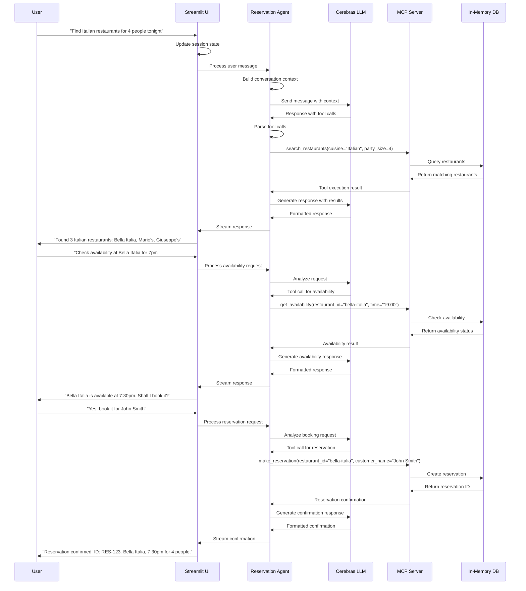
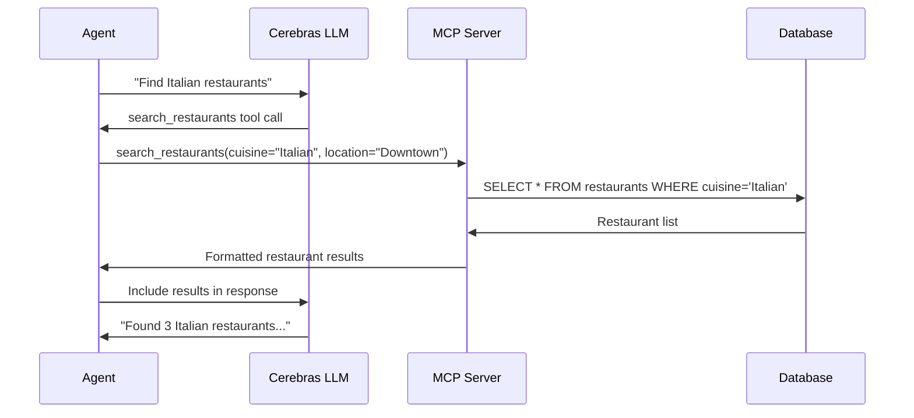
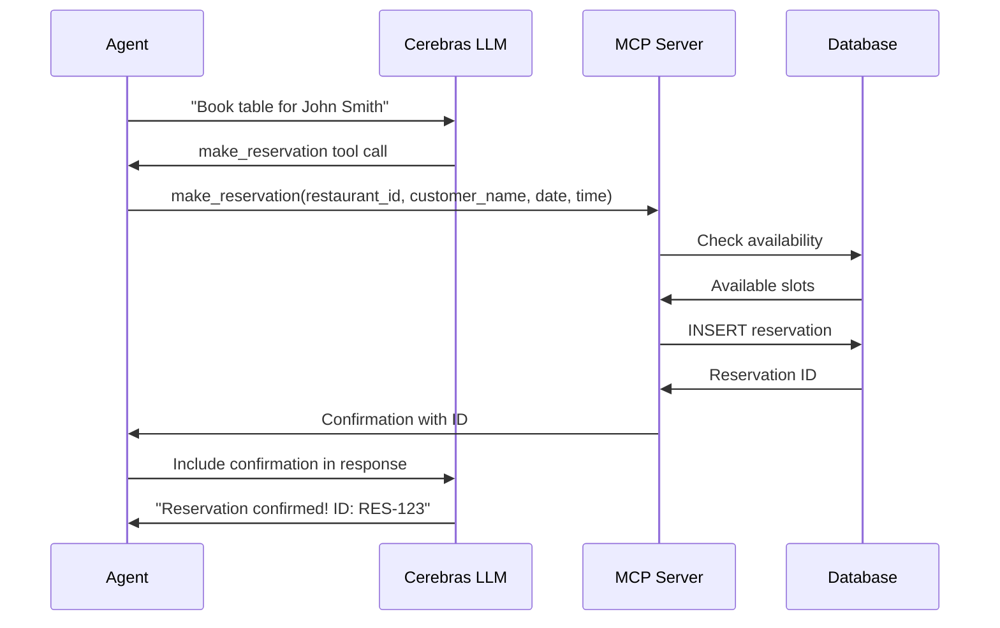
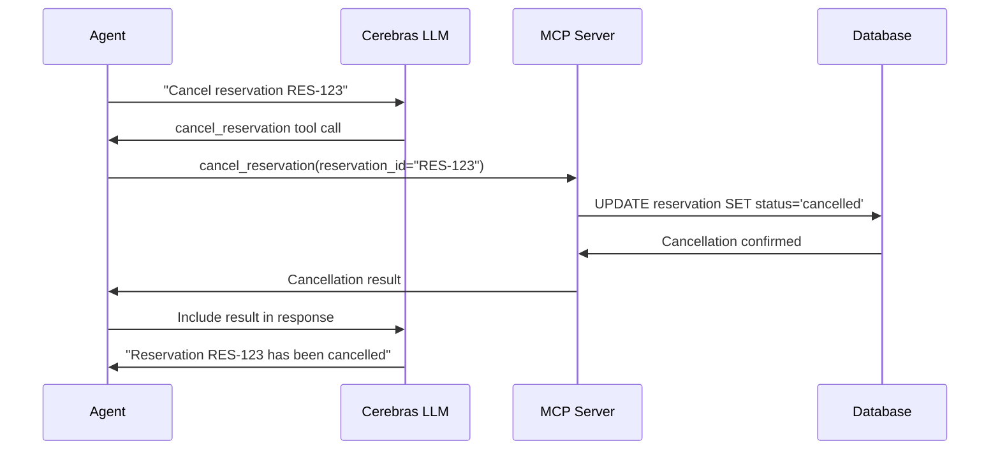
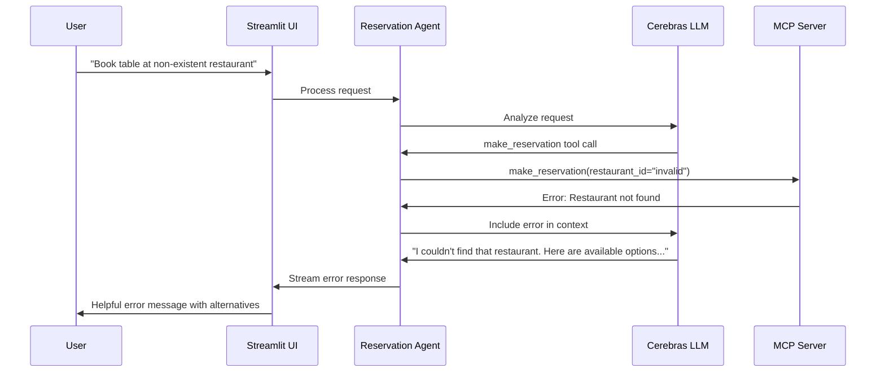
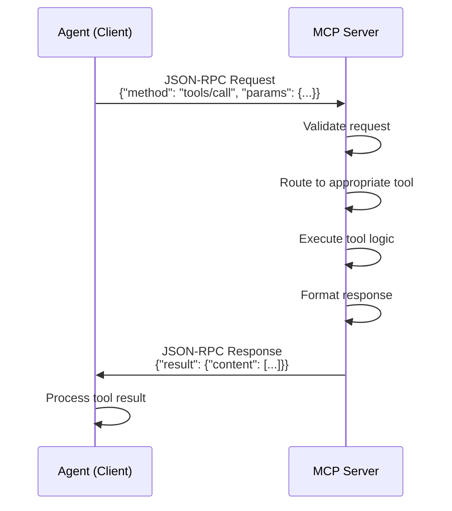

# GoodFoods Reservation Agent - Mermaid Sequence Diagram

## Complete User Interaction Flow

## Tool-Specific Sequence Flows

### Search Restaurants Flow

### Make Reservation Flow

### Cancel Reservation Flow

## Error Handling Flow

## MCP Protocol Communication

